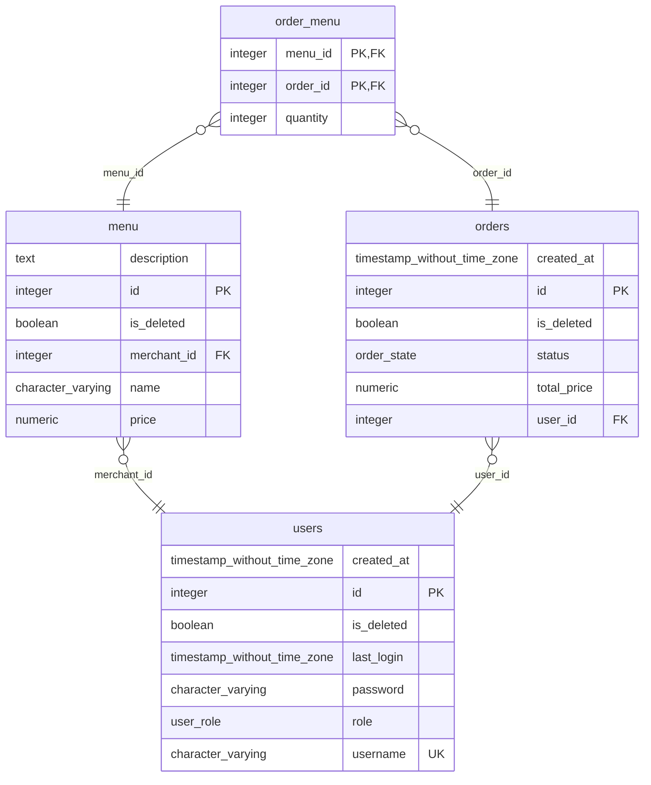
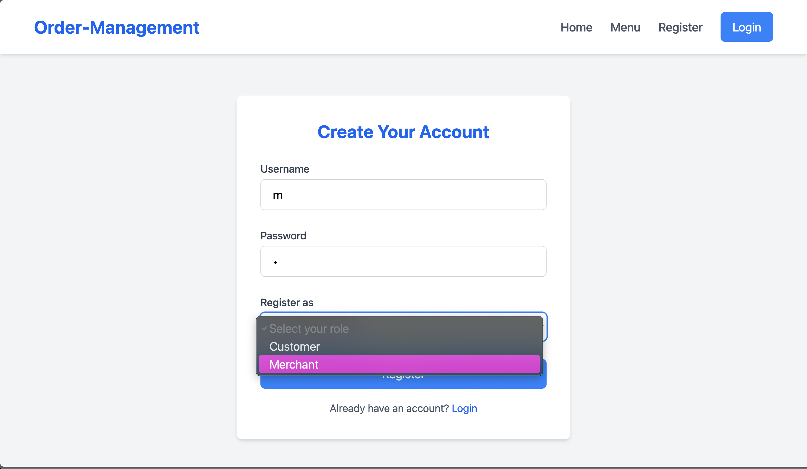
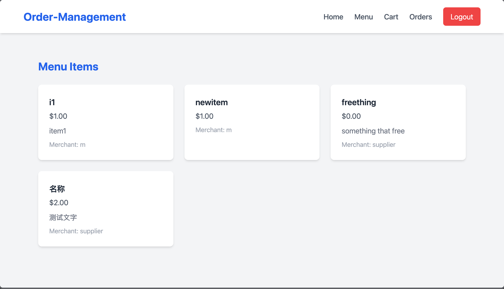

# Order Management （订餐管理系统）

数据库原理课程设计

## 项目结构

```tree
Order-Management
├── db
│   └── schema.sql
├── deno.json
├── dev.ts
├── fresh.config.ts
├── fresh.gen.ts
├── main.ts
├── README.md
├── routes
│   ├── _404.tsx
│   ├── _app.tsx
│   ├── _middleware.ts
│   ├── (auth)
│   │   ├── _middleware.ts
│   │   ├── login.tsx
│   │   └── register.tsx
│   ├── admin
│   │   └── allusers.tsx
│   ├── index.tsx
│   ├── logout.ts
│   ├── menu.tsx
│   ├── merchant
│   │   ├── _middleware.ts
│   │   ├── createmenu.tsx
│   │   └── orders.tsx
│   └── orders.tsx
├── tests
│   ├── db_test.ts
│   └── session_test.ts
└── utils
    ├── db.ts
    └── session.ts
```

### db/schema.sql

数据库结构定义文件，使用 SQL 语言定义数据库表结构。

### deno.json dev.ts fresh.config.ts fresh.gen.ts

Deno fresh 项目配置文件。

### utils/

#### db.ts

封装所有对 postgres 的访问，定义数据表对应的接口类型。

#### session.ts

通过 redis 管理用户会话。

### tests/

测试对 postgres 和 redis 的连接是否正常。

### routes/

包含所有页面路由，包括登录、注册、创建菜单、客户下单、订单查询等。

## 数据库存储结构

### ENUM 类型

1. **`order_state`**
   - **定义**：ENUM 类型，包含值 `'pending'`（待处理）、`'completed'`（已完成）、`'cancelled'`（已取消）。
   - **用途**：用于 `orders` 表，表示订单的状态。
   - **作用**：限制订单状态只能是这三种值，确保数据一致性。

2. **`user_role`**
   - **定义**：ENUM 类型，包含值 `'customer'`（客户）、`'merchant'`（商家）、`'admin'`（管理员）。
   - **用途**：用于 `users` 表，表示用户的角色。
   - **作用**：限制用户角色为这三类，便于区分客户、商家和管理员。

### 表结构

#### 1. `users` 表（用户表）

- **用途**：存储注册用户信息（客户、商家或管理员）。
- **字段**：
  - `id`（整数，主键，自增）：用户唯一标识。
  - `username`（varchar(50)，非空，唯一）：用户登录名。
  - `password`（varchar(60)，非空）：存储加密密码（使用 bcrypt 加密）。
  - `role`（user_role，非空）：用户角色（`customer`、`merchant` 或 `admin`）。
  - `created_at`（时间戳，非空，默认 CURRENT_TIMESTAMP）：用户创建时间。
  - `is_deleted`（布尔值，非空，默认 false）：软删除标志，用于标记用户是否被删除。
  - `last_login`（时间戳，非空，默认 CURRENT_TIMESTAMP）：用户最后登录时间。
- **约束**：
  - 主键：`id`
  - 唯一约束：`username`
- **备注**：支持不同类型的用户（客户下单、商家创建菜单、管理员管理平台）。

#### 2. `menu` 表（菜单表）

- **用途**：存储商家提供的菜单项。
- **字段**：
  - `id`（整数，主键，自增）：菜单项唯一标识。
  - `name`（varchar(50)，非空）：菜单项名称（如“汉堡”）。
  - `price`（numeric(10,2)，非空）：价格，精确到两位小数（如 9.99）。
  - `description`（文本）：菜单项描述（可选）。
  - `merchant_id`（整数，非空）：关联到 `users` 表的商家 ID。
  - `is_deleted`（布尔值，非空，默认 false）：软删除标志。
- **约束**：
  - 主键：`id`
  - 外键：`merchant_id` 关联 `users(id)`。
- **备注**：允许商家列出可出售的商品或服务。

#### 3. `orders` 表（订单表）

- **用途**：记录用户下的订单。
- **字段**：
  - `id`（整数，主键，自增）：订单唯一标识。
  - `user_id`（整数）：关联到下单用户的 `users(id)`。
  - `status`（order_state，非空，默认 'pending'）：订单状态（`pending`、`completed` 或 `cancelled`）。
  - `total_price`（numeric(10,2)，非空）：订单总金额。
  - `created_at`（时间戳，非空，默认 CURRENT_TIMESTAMP）：订单创建时间。
  - `is_deleted`（布尔值，非空，默认 false）：软删除标志。
- **约束**：
  - 主键：`id`
  - 外键：`user_id` 关联 `users(id)`。
- **索引**：
  - `idx_orders_user_id`：在 `user_id` 上建立索引，优化按用户查询订单的性能。
- **备注**：记录订单的总体信息，关联用户和订单。

#### 4. `order_menu` 表（订单-菜单关联表）

- **用途**：连接订单和菜单项，记录每项的数量。
- **字段**：
  - `order_id`（整数，非空）：关联到 `orders(id)`。
  - `menu_id`（整数，非空）：关联到 `menu(id)`。
  - `quantity`（整数，非空，检查约束：quantity > 0）：订单中该菜单项的数量。
- **约束**：
  - 主键：复合主键 (`order_id`, `menu_id`)。
  - 外键：`order_id` 关联 `orders(id)`，`menu_id` 关联 `menu(id)`。
  - 检查约束：确保 `quantity` 大于 0。
- **备注**：支持订单包含多个菜单项，并记录每项数量。

### 表关系

通过外键建立以下关系：

- **用户到菜单**：一个用户（商家）可以拥有多个菜单项（`menu.merchant_id` 关联 `users.id`）。
- **用户到订单**：一个用户（客户）可以下多个订单（`orders.user_id` 关联 `users.id`）。
- **订单到订单-菜单**：一个订单可以包含多个菜单项（`order_menu.order_id` 关联 `orders.id`）。
- **菜单到订单-菜单**：一个菜单项可以出现在多个订单中（`order_menu.menu_id` 关联 `menu.id`）。

通过 `order_menu` 表，`orders` 和 `menu` 形成**多对多关系**，允许订单包含多个菜单项，菜单项出现在多个订单中。

### 主要特性

1. **软删除**：
   - `users`、`menu` 和 `orders` 表均有 `is_deleted` 字段，支持软删除，保留数据以便审计或恢复。

2. **自增 ID**：
   - `users`、`menu` 和 `orders` 表的 `id` 字段使用序列（`users_id_seq`、`menu_id_seq`、`orders_id_seq`）自动生成唯一 ID。

3. **数据完整性**：
   - 外键约束确保引用有效（如菜单项必须属于有效商家）。
   - `order_menu_quantity_check` 约束确保数量大于 0。
   - `users.username` 的唯一约束防止用户名重复。

4. **查询优化**：
   - `idx_orders_user_id` 索引优化按用户 ID 查询订单的性能，如获取用户订单历史。

5. **触发器**
   - `update_order_total_price` 函数在 `order_menu` 表中插入或更新记录时执行，自动更新 `orders` 表的 `total_price` 字段。

### ER 图



## 数据库操作

数据库只负责提供查询，对权限的控制在路由中间件中完成。

### 注册

- 向 `users` 表插入新用户信息。
- 权限：
  - 注册客户和商家不需要权限。
  - 注册管理员需要管理员权限。

### 登录

- 向 `users` 表查询用户信息。
- 验证密码是否正确。
- 记录用户最后登录时间。

### 商家创建菜单

- 向 `menu` 表插入新菜单项。
- 权限：
  - 客户不能创建菜单。
  - 商家创建的菜单 id 只能是自己。

### 查看菜单

- 向 `menu` 表查询菜单项，连接到 `users` 表获取商家信息。
- 权限：
  - 客户可以查看所有菜单。
  - 商家只能查看自己的菜单。

### 客户下单

- 向 `orders` 表插入新订单。
- 向 `order_menu` 表插入 订单-菜单 关联记录。
- 权限：
  - 商家不能下单。
  - 客户创建的订单所有者只能是自己，订单的所有项必须来自同一个商家。

### 订单查询

- 向 `orders` 表查询订单信息。
- 权限：
  - 客户和商家可以查询关于自己的订单。

### 订单状态更新

- 向 `orders` 表更新订单状态。
- 权限：
  - 客户不能更新订单状态
  - 商家只能更新属于自己的订单的状态

## 路由

### _middleware.ts

全局中间件，用于设置用户信息，并捕获所有异常。

### _app.tsx

全局组件，设置顶部导航栏，包括主页、菜单、订单、登陆等。

### index.tsx

主页，显示介绍信息。

### (auth)/_middleware.ts

在用户已经登陆时重定向到主页。

### (auth)/login.tsx

登录页面，用户可以输入用户名和密码进行登录。

### (auth)/register.tsx

注册页面，用户可以注册新账号，选择身份为客户或商家。

### logout.ts

登出页面，清空浏览器 cookie 和 redis 中的会话信息。

### orders.tsx

查询订单页面。

### menu.tsx

查看菜单页面。

### cart.tsx

管理购物车。

### merchant/_middleware.ts

验证身份为商家。

### merchant/createmenu.tsx

添加商品。

### merchant/orders.tsx

管理订单。

### admin/_middleware.tsx

验证身份为管理员。

### admin/allusers.tsx

查看所有用户。

## ui

页面通过 server side rendering 和 tailwind css 实现。

### 注册



### 菜单



## 附录

项目源码 <https://github.com/iuy1/Order-Management>
